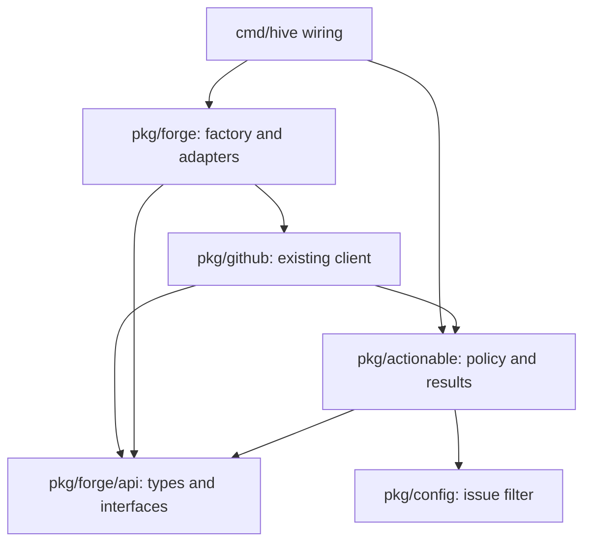

# ADR-0019: Forge-neutral actionable enumeration with GitHub parity

Status: Proposed

## Context

The governor starts with `github.Client.EnumerateActionable`. Its issue and PR
fetchers also decide which work Hive may offer: hold and exempt labels, the
issue approval filter, tracker detection, SLA accounting, and draft handling.
Moving only the HTTP calls would bypass those decisions. Leaving them in
`pkg/github` keeps the other forge adapters unreachable from the work cycle.
This is T2 ([#6170](https://github.com/hivecommons/hive/issues/6170)) in the
Gitea series tracked by [#6167](https://github.com/hivecommons/hive/issues/6167),
and designs the enumeration step named in the [roadmap](../roadmap.md).

The baseline inspected here is `v4` at `fe34da51`. Three details matter to the
design:

- The [GitHub forge adapter](../../pkg/forge/github_forge.go) implements each
  per-repository list by calling the **whole** `EnumerateActionable` and then
  filtering its result. Calling both methods for N repositories would run
  the whole enumeration 2N times. Its factory also constructs a client with
  no configured repositories, so that standalone adapter currently lists
  nothing. Neither method can supply an unfiltered enumeration input.
- `pkg/forge` imports `pkg/github` for that adapter. A naive extraction in
  which `github` imports `actionable` and `actionable` imports `forge` creates
  an import cycle.
- [#6158](https://github.com/hivecommons/hive/pull/6158), the standing-meta
  skip cited by the task, is still an open PR at this baseline. Its proposed
  position is **after the raw issue count, before hold/exempt filtering**.
  `ActionableResult.Clusters` exists, but `EnumerateActionable` never fills
  it; there is no clustering algorithm to extract from this baseline.

The source of truth is the [result types and enumeration functions in
client.go](../../pkg/github/client.go), including their helpers, plus
[`IssueFilterConfig.Admits`](../../pkg/config/issue_filter.go). Pending changes
must be incorporated into the compatibility baseline when they merge; this
ADR does not assert that their behavior already ships.

## Decision

### Policy belongs in `pkg/actionable`

Create `pkg/actionable` for classification, result assembly, and the
`ActionableResult` family of types. It consumes a narrow bulk read extension
of the forge API and effective policy configuration. Forge adapters supply
unfiltered open issues and change requests, translating native wire fields
and excluding PR records from issue endpoints. They do not apply hold,
exempt, approval, tracker, SLA, or draft policy.

Keep adapters and `NewForge` in `pkg/forge`, and introduce a leaf package,
`pkg/forge/api`, containing only neutral types and interfaces. Re-export its
types from `pkg/forge` with **type aliases**, including `Forge`, `IssueWriter`,
`Issue`, `ChangeRequest`, and the new bulk read interface. This is a mechanical
dependency split, not a second forge model. `actionable` imports the leaf,
never the adapter factory. The resulting imports are acyclic:



Move the complete result type family together: `ActionableResult`, `Issue`,
`IssueDependency`, `PullRequest`, `Mergeable`, `RepoCounts`, `IssueResult`,
`PRResult`, `HoldResult`, `HoldItem`, and `IssueCluster`. Preserve their field
order, JSON tags, constants, and method sets; for example,
`PullRequest.HasFailingRequiredCheck` moves with its type. Leave aliases and
delegating public helpers in `pkg/github`, so scheduler, dashboard, governor,
and work-source consumers continue compiling against `github.ActionableResult`.
The raw `forge.Issue` and actionable `Issue` remain distinct: the latter is a
policy result and deliberately does not expose the raw body.

Expose an `actionable.Enumerator` seam with the existing signature:

```go
type Enumerator interface {
    EnumerateActionable(context.Context) (*ActionableResult, error)
}
```

For GitHub, the value at that call site remains the existing `*github.Client`,
with its existing App/token transport, repository configuration, logging, and
nil-receiver behavior. Its method becomes a compatibility wrapper around the
engine; its new bulk read method supplies raw data directly through the same
go-github client. For Gitea, wiring supplies an engine backed by the configured
forge adapter. This follows the static-type seam used by
[`governorForge` for escalation writes](../../cmd/hive/forgewire.go) in
[#5259](https://github.com/hivecommons/hive/issues/5259), without constructing
a replacement GitHub client or routing GitHub through `NewForge`.

Putting policy under the current `pkg/forge` would mix operational policy with
transport and would still require resolving the import cycle. Moving every
adapter into new packages would also solve the cycle, but causes more factory
and caller churn than the leaf-and-alias split. Duplicating policy in each
adapter is rejected because every new forge would become another place where
an approval or hold gate could diverge.

### Field-gap checklist for T3

The following inventory covers every item field used by `fetchIssues` and
`fetchPRs`, the structural PR discriminator, and every existing neutral field
that might otherwise look like a missing requirement. “Present” means present
in the neutral types today; adapter mapping still needs verification. `I` is
`forge.Issue`, `CR` is `forge.ChangeRequest`.

| Field / source | Current neutral shape | Required mapping and policy use |
| --- | --- | --- |
| Repository argument | `I.Repo`, `CR.Repo` present | Preserve the **configured repository string** in actionable items, hold items, and `TotalByRepo` keys. GitHub uses `repo`, not necessarily `owner/repo`. Resolve the API owner separately; the batch's input index preserves this distinction even when an adapter returns a canonical slug. |
| `number` / repository-local ID | `I.Number`, `CR.Number` present | Copy into items and hold records. GitLab uses `iid`, not its global object `id`; Gitea uses `number`. Issue and PR identity stay separate. |
| `title` | Both present | Copy verbatim; used by tracker detection, held-item display, and the pending standing-meta skip. |
| `user.login` / author | Both `Author` fields present | Preserve GitHub's nil user → empty string. GitLab maps `author.username`; Gitea maps `user.login`. Used for bot-owned stale drafts and standing-meta detection; an extra inferred `IsBot` flag is unnecessary. |
| Label names | Both `Labels` fields present | Preserve names, order, duplicates, and GitHub's nil-slice behavior. GitHub's extraction also retains empty names. These feed the distinct hold, exempt, require, tracker, and standing-meta predicates. Do not normalize case or trim actual labels in transport. |
| Issue assignee logins | `I.Assignees` present | Preserve order; GitHub drops nil users and empty logins. GitLab/Gitea already map their assignee arrays. PR assignees are not read by `fetchPRs`. |
| `created_at` | Both `CreatedAt` fields present | Preserve the timestamp and its zero value. Drives issue age/SLA and the strict stale-draft cutoff; no replacement with fetch time. |
| Issue `updated_at` | **Missing from `I`** | Add `UpdatedAt time.Time`; populate in all three adapters. GitHub copies it into the result for activity-based contribute-queue invalidation. Gitea and GitLab wire structs currently omit it too. |
| Issue `body` / GitLab `description` | **Missing from `I`** | Add `Body string`; populate before policy. `IsTrackerIssue` needs the complete Markdown task list. The current GitHub adapter cannot recover it from its already-filtered actionable result. Do not truncate, strip Markdown, or fetch details per issue. |
| PR discriminator on an issue response | No neutral field needed | GitHub's `issue.IsPullRequest()` and Gitea's `pull_request != nil` are transport-level exclusions, before issue counts. GitLab issue/MR endpoints are separate. Test mixed responses, including a page containing only PR records. |
| Web URL (`html_url`, GitLab `web_url`) | Both `URL` fields present | Copy the API-provided web URL, including private-instance hosts; do not reconstruct a github.com URL. |
| Open state | Both `State` fields present | List requests select open objects. GitLab currently returns `opened`. The legacy actionable issue's `State` is nevertheless left empty, and `PullRequest` has no state field. Do not start serializing `"state":"open"` during extraction. |
| PR `draft` | `CR.Draft` present | GitHub/Gitea map `draft`; GitLab currently maps `draft || work_in_progress`. Raw lists must retain drafts for policy to classify. Do not infer draft status from a title as part of extraction. |
| PR `head.sha` | `CR.HeadSHA` present | GitHub needs a raw mapping with nil head → empty string. Gitea maps `head.sha`; GitLab maps `sha`. Copy only for ordinary actionable PRs: the legacy stale-draft result intentionally omits it. |
| Head/base ref | `CR.SourceBranch`, `TargetBranch` present | Gitea/GitLab already populate them; the GitHub adapter currently drops them. T3 completes the GitHub raw mappings from `head.ref` / `base.ref`, with nil branch → empty string. `fetchPRs` does **not** consume these refs, so they add no actionable-result field. |
| PR body, updated time, assignees | Not in `CR` | Not consumed by `fetchPRs`; **not required additions for enumeration parity**. Later create/merge designs may justify them separately. |

Thus the required new item fields are `Issue.Body` and `Issue.UpdatedAt`.
GitHub also needs a genuinely raw list mapping, including its already-declared
branch refs. Adding fields alone cannot restore information its current
adapter has already filtered away. T3 must test all three adapters against raw
HTTP fixtures, not just a stub returning an `ActionableResult`.

Other inputs and outputs must not be mistaken for missing forge fields:

| Value | Owner and compatibility requirement |
| --- | --- |
| `GeneratedAt`, issue `AgeMinutes`, `SLAViolations` | Engine clock and policy. Age is `int(now.Sub(CreatedAt).Minutes())`, without clamping; SLA counts `AgeMinutes > 30`, not elapsed duration >30 minutes. |
| Effective hold/exempt labels, `project.issue_filter`, App bot login | Hive configuration/client state, not forge item fields. Keep the current defaults and matching rules. Gitea wiring must supply the actual bot identity for stale drafts; do not assume a GitHub `[bot]` suffix. |
| `IsTracker` | Derived from issue title, labels, and body. Preserve the flag rather than removing trackers from enumeration: downstream consumers decide how to use them. |
| `Priority`, `State`, `SourceType`, `ExternalID`, `DependsOn`, `ComplexityTier`, `ModelRec`, `Lane` | Existing actionable issue fields left at their zero values by GitHub enumeration. Preserve the envelope and its omission rules; work-source overlays populate their own metadata later. |
| `Mergeable`, `CIStatus`, `FailingChecks`, `CIFailureExcerpt` | Existing actionable PR fields left unknown/empty by enumeration. `EnrichCIStatus` subsequently uses PR detail/check APIs. Do not add per-PR calls to the bulk list or infer “mergeable” from open/non-draft status. |
| `Hold`, `TotalByRepo`, `Clusters` | Engine aggregates, not API fields. Counts follow the rules below; `Clusters` remains nil/omitted at this baseline. Introducing clustering is separate work. |

### One bulk read per pass, with ordered list boundaries

Add an optional `OpenLister` extension alongside `Forge`, re-exported from the
leaf API. All three adapters implement it before the engine uses them;
`*github.Client` implements it directly. Keeping it narrow allows the existing
GitHub client to satisfy it without implementing every `Forge` method.
An adapter selected for enumeration must support this extension; lack of it
is a wiring error, not permission to fall back to the old per-repo methods.

Use one call for the entire ordered repository list. Deliver a completed
resource list to an engine-owned sink before starting the next resource.
This sketch is a proposed API, not code added by this ADR:

```go
// pkg/forge/api; aliases also available through pkg/forge.
type PaginationBudget struct {
    MaxPagesPerResource int // zero: no additional cap
    MaxRequests         int // total list requests in this pass; zero: no cap
}

type OpenList[T any] struct {
    Items []T // complete resource list; nil on error
    Pages int // requests spent on this resource, including a failed request
    Err   error
}

type OpenSink interface {
    BeginIssues(repoIndex int)
    Issues(repoIndex int, result OpenList[Issue])
    BeginChangeRequests(repoIndex int)
    ChangeRequests(repoIndex int, result OpenList[ChangeRequest])
}

type OpenLister interface {
    ListOpen(ctx context.Context, repos []string, budget PaginationBudget,
        sink OpenSink) error
}
```

For each input entry the sequence is `BeginIssues → Issues →
BeginChangeRequests → ChangeRequests`. An issue-list failure ends that entry
after `Issues`; PRs are not fetched for it. Each begin callback runs immediately
before that resource's first request; each result callback runs once, after
all pages or the first failure. Callbacks are synchronous, with no concurrent
delivery. They only observe boundaries and collect/classify results; transport
does not inspect policy or callback state. Per-resource API, decoding,
cancellation, and budget errors are carried in `OpenList.Err`. The method's
outer error is reserved for an invalid invocation, such as a nil sink.

These boundaries are intentional. Today `EnumerateActionable` samples one
clock value for issue ages and `GeneratedAt`, but `fetchPRs` samples a **new**
value before each repo's PR fetch. `fetchIssues` snapshots `issue_filter`
before its first request and classifies its completed list before PR fetching.
The engine uses the begin/result callbacks to preserve those points; a batch
that returned only after all repositories finished would subtly move the
draft cutoff and configuration reads. Existing GitHub setters remain wired
through the compatibility wrapper, with effective values read at their
existing points. The extraction must not quietly replace them with a global
clock, a cycle-wide filter snapshot, or new reload semantics.

The engine accumulates actionable items, then finalizes the result once the
bulk call returns. Results retain repository input order and endpoint page
order. Input indices preserve duplicate repository entries and bare versus
qualified names; the GitHub compatibility path must not start deduplicating
or canonicalizing its configured list.

“Bulk” means one traversal and one policy pass, not a promise of one HTTP
request across an instance. The request count is
`sum(issue pages + PR pages for entries whose issue listing succeeded)`,
which is O(N) for fixed repository sizes. The new GitHub method calls the
existing underlying `Issues.ListByRepo` / `PullRequests.List` endpoints. It
must never call `EnumerateActionable`, `ListOpenIssues`, or
`ListOpenChangeRequests` to obtain raw data. Legacy per-repo methods stay
outside the new engine; retaining them temporarily does not authorize the
2N-full-enumeration fallback. No search-API replacement or cross-cycle cache
is introduced.

Pagination rules:

- GitHub preserves `per_page=100`, endpoint defaults, and `NextPage` traversal.
  The current path has **no numeric page cap**; its compatibility budget uses
  zero for both limits and propagates the caller's context unchanged. A new
  finite GitHub cap would change results for a large repository and cannot
  be slipped into a byte-identical extraction. It requires a separately
  reviewed behavior change. Test a fixture beyond 100 pages explicitly.
- For the new Gitea and GitLab bulk methods, retain the current requested
  page sizes (50 and 100 respectively) and use a default cap of 100 requests
  per repository/resource, with a pass budget of `2 * len(repos) * 100`.
  These are transport budgets, not limits on actionable items. A page of
  excluded PR records still consumes a page; filters never refund requests.
- Preserve each adapter's completion convention: GitHub `NextPage == 0`,
  GitLab absent/zero `X-Next-Page`, Gitea a short page. A terminal response
  exactly at the cap succeeds. If continuation remains, the **new bulk
  method** returns a typed budget error for that resource and discards its
  accumulated items. Gitea's full 100th page needs another request to prove
  completion, so it is incomplete at that cap. The existing Gitea/GitLab
  helpers silently return partial success at their caps; do not reuse that
  behavior for the new method or claim it is complete enumeration.
- Exhausted pass budgets prevent further HTTP requests. Remaining attempted
  resources report scoped budget errors through the same ordered callbacks.
  Cancellation likewise stops network work and preserves ordinary partial
  result accounting; it does not convert already-completed issue data into
  an all-repositories-failed result. No additional retry loop is added.

### GitHub policy and result invariants

The extraction preserves observable behavior, including the following
asymmetries in [client.go](../../pkg/github/client.go):

1. **Issue order of operations:** remove PR records → increment raw issue
   total → standing-meta skip when #6158 has merged → hold → exempt →
   `issue_filter.Admits` → compute age and tracker flag → append. A held issue
   appears in `Hold` even without an approval label. An exempt issue remains
   excluded even with approval. Standing meta issues remain in the raw total
   but, under #6158, enter neither the actionable nor held set.
2. **Matching rules differ:** hold is a case-insensitive substring match
   against the existing `HoldLabels` (`hold`, `on-hold`, `hold/review`);
   enumeration currently calls it without extra configured hold labels.
   Exempt is case-insensitive equality **or case-sensitive prefix**, including
   permanent `do-not-merge`. Require is case-insensitive equality, trimming
   only the configured label, and any one required label suffices. An empty
   require list admits everything; a whitespace-only entry is not an empty
   list. Preserve these distinctions instead of “fixing” matching while
   moving it.
3. **Tracker detection:** exact `[Tracker]` title prefix, exact `meta-tracker`
   label, or at least three Markdown task-list issue references matched by
   the existing regexp. Checked tasks also count. A tracker is still in
   `Issues.Items`, the count, and SLA accounting.
4. **PR order:** increment raw PR total → hold → exempt → draft handling →
   ordinary actionable PR. Issue require labels and tracker/standing-meta
   detection never filter PRs. A held draft is a held PR. An unheld,
   non-exempt draft is excluded from ordinary items and enters `StaleDrafts`
   only when its author equals `appBotLogin` case-insensitively and its age
   is **strictly greater than 48 hours**. Preserve the current empty-login
   comparison too; adding a guard is a separate behavior change.
5. **Ordering and representation:** sort issues using the existing
   `sort.Slice` comparison on descending integer `AgeMinutes`. No new stable
   sort or tie-breaker. PRs and stale drafts retain fetch order; hold entries
   retain per-repo issues-then-PRs order. Keep nil slices, omitted fields,
   empty strings, timestamp precision, and JSON struct-field order.
6. **Resource failures:** discard all pages of a failing resource. If issue
   fetching fails, skip that repository's PR fetch. If PR fetching fails,
   keep that repo's already-collected issues and held issues, but add **no**
   `TotalByRepo` entry, including no issue-only entry. Other repos continue.
7. **All-failed versus empty:** return nil and the existing wrapped
   `all N repos failed to enumerate (last error: ...)` error only when every
   configured entry's **issue** fetch failed. An all-PR-failed pass with
   successful issue reads still succeeds. Preserve the last issue error in
   configured order and its unwrap chain. An empty repo list succeeds with
   zero counts and nil item slices; the initialized empty `TotalByRepo` map
   is omitted from JSON. Nil GitHub client still returns `ErrNoGitHubClient`.

Under #6158, the standing-meta predicate is an exact advisory title **or** a
case-insensitive advisory label; its bot-dashboard arm requires a known bot
author **and** a dashboard title fragment. Carry that predicate as merged,
including positive controls for human-authored issues. Do not broaden it to
all bots or all titles containing “dependencies” during extraction.

### Compatibility proof and merge gate for T5

Build the proof before redirecting the production method. It has two layers:

1. **Independent legacy oracle.** Freeze the pre-extraction enumeration and
   predicates in test-only code, recording the baseline commit. Preserve its
   HTTP behavior; the only instrumentation is a per-instance clock seam
   replacing the existing `time.Now` reads. It must not delegate filtering
   or assembly to the new engine. Rebase this oracle onto any merged #6158
   policy before extracting it. If #6158 is still pending, record that fact
   and keep its prospective fixtures separate until it lands.
2. **End-to-end fixture parity.** Run that legacy path and the production raw
   GitHub reader plus new engine against identical scripted HTTP responses,
   headers, repository configuration, policy, and clock sequences. Assert
   exact `json.Marshal(ActionableResult)` bytes against each other **and**
   checked-in golden JSON generated by the legacy oracle. Do not normalize
   `GeneratedAt`, sort output again, coalesce nil/empty slices, or remove
   fields before comparison. Structural assertions supplement the byte
   check for empty maps/slices that `omitempty` hides. Compare nil-result
   behavior, exact error text, unwrap identity, and request traces separately.

Use an in-memory transport with a fixed URL to keep error messages independent
of `httptest` port numbers. Give each run its own replay and clock; each
consumes the same ordered samples (enumeration start, then each attempted PR
list start). Include samples that cross the 48-hour boundary during issue
fetching. No real sleeps, live credentials, or package-global clock mutation.
Configuration callbacks also allow deterministic reloads at list boundaries
to prove the existing snapshot timing, without depending on a data race.

Required fixture groups and what they establish:

| Fixtures | Contract pinned |
| --- | --- |
| Empty repo list; empty endpoints; bare/qualified and duplicate repo entries; several owners; equal integer ages | Exact envelope, repo-key spelling, iteration/hold order, and current unstable-sort tie behavior. |
| All field values plus absent/null user, head, labels, assignees and timestamps; empty/duplicate labels | Full raw mapping, nil handling, no new actionable fields, missing-head behavior, and no lossy normalization. |
| All hold names plus substring/case variants; permanent/configured exemptions with equality and prefix-case differences; require absent, empty, multiple, whitespace and prefix near-matches | Every label predicate and hold/exempt/require precedence at the actual enumeration entry point. Include a PR without required issue labels. |
| Ordinary issue, title/label tracker, two versus three task references, checked and cross-repo references | Full body retention and tracker classification without silently removing trackers from counts or SLA. |
| Ages just below/at/above integer SLA boundaries, future creation times, fresh/stale own drafts, human drafts, empty bot identity, held/exempt drafts | Integer truncation and strict thresholds, per-PR clock timing, draft channel membership, and stale-draft head-SHA omission. |
| Advisory title/label, held advisory, known bot dashboards, human dashboard titles and ordinary bot issues | #6158's structural skip before hold, unchanged raw totals, and narrow positive controls once that PR is in the baseline. |
| Multiple pages including PR-only issue pages, an error after a successful page, 403/rate-limit/5xx and cancellation at each resource boundary | Whole-resource discard, skipped PR calls after issue failure, retained issues after PR failure, missing totals, and exact all-failed/error propagation. |
| N repositories, all-PR failure, mixed success, and GitHub >100 pages | One complete pass, original endpoint/query sequence, no hidden relist, no accidental page cap. |
| Gitea/GitLab exact terminal page, continuation at cap, pass budget exhaustion | New bulk readers report incomplete resources as errors rather than successful truncated queues; these are adapter contract tests, not claims of old GitHub behavior. |
| Config update between repositories and between issue/PR phases; repeated enumerations | Correct setter/snapshot timing, fresh configuration and data, no cross-cycle cache. |

Prove the test can reject drift: locally mutate a gate/order/count in the new
engine (for example, admit a held issue or populate totals after PR failure)
and require the corresponding parity case to fail. Golden regeneration must
use the independent oracle, not the new implementation, and baseline changes
must be reviewed explicitly rather than accepted by a blanket update command.

Retain the existing [enumeration tests](../../pkg/github/client_test.go),
[issue-filter tests](../../pkg/github/issue_filter_test.go),
[stale-draft tests](../../pkg/github/stale_draft_test.go), and
[mergeability tests](../../pkg/github/mergeable_test.go). Run the new parity
suite with the full affected packages, for example from `src/`:

```sh
go test ./pkg/github ./pkg/forge/... ./pkg/actionable/... ./pkg/worksource ./pkg/governor ./pkg/scheduler
go test -race ./pkg/github ./pkg/forge/... ./pkg/actionable/...
go build ./...
go test ./...
```

These are **future extraction checks**: `pkg/actionable` and `pkg/forge/api`
do not exist in this docs-only PR. The extraction cannot merge with a parity
failure, weakened golden comparison, or unaccounted policy baseline change.
After the seam changes, a separate integration fixture must compare the
post-enumeration work-source overlay and existing GitHub CI enrichment too;
the engine itself is tested before those stages mutate the result.

### Sequencing and scope

- **T3 (wave 1):** introduce the leaf API and aliases, fill the two issue
  fields and raw adapter mappings, and implement/test the bulk extension.
  Keep the live GitHub enumeration on its existing implementation. This
  work must not invoke policy through the old GitHub forge adapter.
- **T5 (wave 2):** establish the independent goldens, extract policy/result
  types with compatibility aliases, and delegate the existing GitHub
  method through the new engine. Keep existing consumers and post-processing
  behavior intact. Alias/method-set and import-graph compilation are part
  of the gate, not deferred cleanup.
- **T6 and later:** select the engine for a configured Gitea hive and make
  governor/dashboard entry points reachable without a GitHub client. This
  includes revisiting `runEvalCycle`'s early nil-GitHub return and its
  GitHub-specific advisory/enrichment/claim calls; changing the enumerator
  type alone does not deliver M1. Audit secondary enumeration callers such
  as `worksource` and rescan callbacks so one cycle shares its result rather
  than silently adding another pass. Existing GitHub work-source overlays
  retain their ordering and failure behavior.

There is **one forge per hive**. `project.forge` remains the single global
selector; endpoint configuration selects one instance of that forge. Empty
selection continues to mean GitHub. Mixed-forge or multiple-instance hives,
per-repo forge selectors, and cross-forge identity federation are deferred.
For a deliberately selected non-GitHub forge, construction/read failures must
be reported for that forge, not fall back to enumerating similarly named
GitHub repositories. This does not change #5259's existing write fallback.

Auth/egress is the separate #6169 ADR, currently proposed as ADR-0018 in
[PR #6175](https://github.com/hivecommons/hive/pull/6175). Enumeration takes a
server-side authenticated reader; it neither distributes tokens nor decides
agent credential injection. Create-issue/PR and merge interfaces, ACMM write
gates, bot-account setup, agent instructions, dashboard login, hosted-hub and
contribute-queue support for Gitea, and a new CI/mergeability abstraction are
outside this decision. In particular, unknown CI/mergeability cannot be
treated as permission to merge when later milestones are wired.

## Consequences

Policy has one home and a transport boundary that retains the information
needed to enforce it. The field table is a concrete wave-1 checklist; the
golden contract is the wave-2 merge gate. New forges can enter the same
classification path without requiring a scheduler rewrite or repeated full
enumerations.

The cost is a small API package, compatibility aliases, and an ordered sink
interface. The sink preserves existing clock/configuration boundaries and
partial failures, so this design intentionally defers concurrent repository
fetching, different sorting, numeric GitHub page caps, and cleanup of legacy
matching quirks. Those changes deserve their own behavior review.

This ADR changes documentation only. It does not make Gitea or GitLab a
supported runtime, and the [forge support matrix](../forge-app-setup.md)
remains accurate until the corresponding milestones ship.
